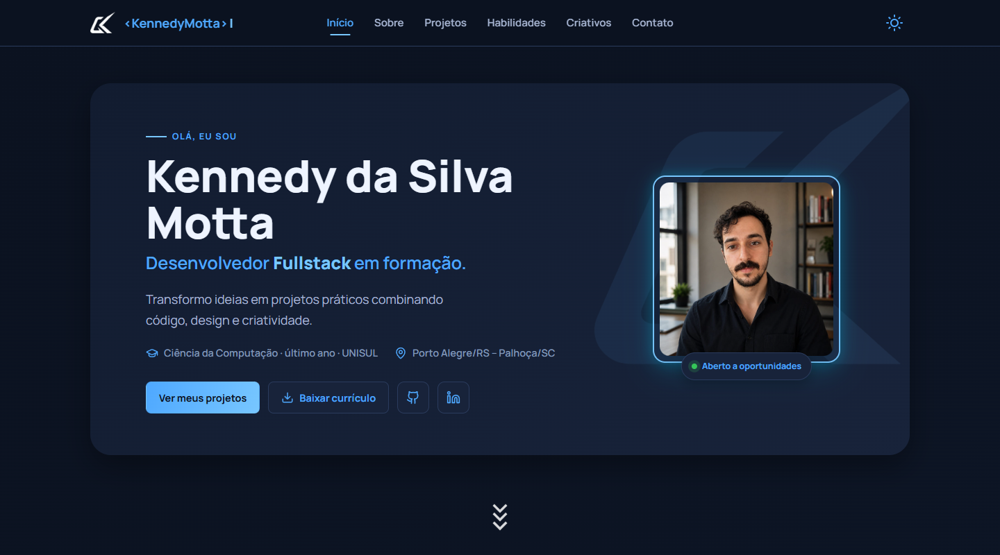

# 👨‍💻 Kennedy Motta — Portfólio

  

<h3 align="center">
  Meu portfólio pessoal desenvolvido para apresentar meus projetos, habilidades e experiências.
</h3>

  <a href="https://kennedymotta.github.io/Site/">
    🌐 Acessar o site
  </a>

---

## ✨ Sobre o projeto

Este é meu portfólio pessoal, desenvolvido para reunir meus principais projetos,
tecnologias que venho estudando e trabalhos relacionados à programação,
design gráfico e edição de vídeo.

O site também funciona como um espaço para acompanhar minha evolução como
desenvolvedor Fullstack em formação.

---

## 🚀 Tecnologias

### 💻 Desenvolvimento

- HTML5
- CSS3
- JavaScript
- TypeScript
- React
- Java
- C#
- Python
- PHP
- Lua

### 🎨 Design e edição

- Adobe Photoshop
- Adobe Illustrator
- Adobe Premiere
- Adobe After Effects

### 🔧 Outras tecnologias

- SQL / MySQL
- Axios
- Vite
- APIs REST
- Git
- GitHub

---

## 📂 Projetos

### 🔴 Pokédex

Pokédex interativa e responsiva que consome a PokéAPI, com busca por nome
ou número e sprites animadas.

**Tecnologias:** React • TypeScript • Vite • Axios

### 📸 InstaClone

Recriação da tela de login do Instagram com HTML e CSS puros, com foco em
layout responsivo.

**Tecnologias:** HTML • CSS

### 🎮 Box Hunters

Jogo que estou desenvolvendo para a plataforma Roblox.

> 🚧 Projeto atualmente em desenvolvimento.

### 🔎 Movie Search CLI

Aplicação desenvolvida em Java utilizando uma API REST para realizar
buscas relacionadas a filmes.

**Tecnologias:** Java • HttpClient • Gson • API REST

### 📋 Todo List

Aplicação de lista de tarefas desenvolvida para praticar TypeScript,
Vite, HTML e CSS.

**Tecnologias:** TypeScript • Vite • HTML • CSS

### 🔢 Jogo do Número Secreto

Projeto desenvolvido para praticar lógica de programação e manipulação
do DOM utilizando JavaScript.

**Tecnologias:** HTML • CSS • JavaScript

---

## 🖥️ Preview

  

---

## 🌐 Acesse

Confira o portfólio funcionando:

**👉 https://kennedymotta.github.io/Site/**

---

## 📫 Contato

<a href="https://github.com/KennedyMotta">
  GitHub
</a>
&nbsp;&nbsp;•&nbsp;&nbsp;
<a href="https://www.linkedin.com/in/kennedy-da-silva-motta-409848308/">
  LinkedIn
</a>
&nbsp;&nbsp;•&nbsp;&nbsp;
<a href="mailto:Kennedymotta.kdsm@gmail.com">
  Email
</a>

---

  Desenvolvido por <strong>Kennedy Motta</strong> 😎

